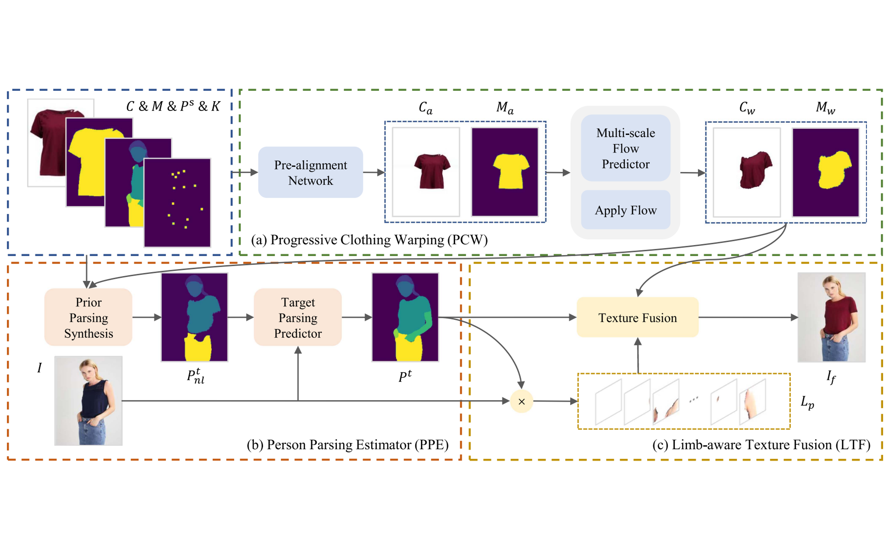
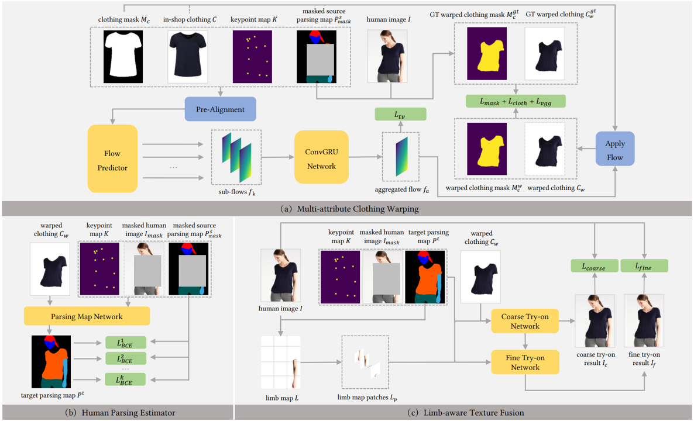

<!-- * B.S. in Communication Engineering, Hefei University of Technology, 2019
* M.S. in Computer Science and Technology, Harbin Institute of Technology, 2021
* Ph.D. in Computer Science and Technology, Harbin Institute of Technology, 2025 (expected) -->
Hi, this is Xiaoyu Han. I am a fourth-year Ph.D. student in Faculty of Computing, Harbin Institute of Technology, advised by Prof. [Shengping Zhang](https://homepage.hit.edu.cn/zhangshengping).
My research focuses on **Virtual Try-on**.

## Background

<table style="width:100%;border:none;border-spacing:0px;border-collapse:separate;margin-right:auto;margin-left:auto;font-size: large">
<tr>
<td style="padding:20px;width:25%;vertical-align:middle;border:none" align="center">
 
</td>
<td style="padding:20px;width:75%;vertical-align:middle;border: none" align="left">
Ph.D. Student. Sep. 2020 - Present 
<a href="https://encs.hit.edu.cn">Faculty of Computing</a> 
<a href="http://en.hit.edu.cn">Harbin Institute of Technology</a> 
</td>
</tr>

<tr>
<td style="padding:20px;width:25%;vertical-align:middle;border:none" align="center">
 
</td>
<td style="padding:20px;width:75%;vertical-align:middle;border:none" align="left">
Bachelor of Engineering. Sep. 2016 - Jun. 2020 
<a href="https://cst.hitwh.edu.cn/">School of Computer Science and Technology</a> 
<a href="https://www.hitwh.edu.cn/">Harbin Institute of Technology, Weihai</a> 
</td>
</tr>
</table>    

## Research

<!-- 

<b>GPS-Gaussian: Generalizable Pixel-wise 3D Gaussian Splatting for Real-time Human Novel View Synthesis</b> 
<b>Shunyuan Zheng</b>, [Boyao Zhou](https://yaourtb.github.io), [Ruizhi Shao](https://dsaurus.github.io/saurus), [Boning Liu](https://liuboning2.github.io), [Shengping Zhang](http://homepage.hit.edu.cn/zhangshengping), [Liqiang Nie](https://liqiangnie.github.io), [Yebin Liu](http://www.liuyebin.com) 
<i>IEEE Conference on Computer Vision and Pattern Recognition (<b>CVPR</b>), 2024</i>  (Highlight) 
[<i class="fas fa-fw fa-globe"></i>Project](https://shunyuanzheng.github.io/GPS-Gaussian) /
[<i class="fas fa-fw fa-file-pdf"></i>Paper](https://arxiv.org/pdf/2312.02155) /
[<i class="fab fa-fw fa-github fa-github"></i>Code](https://github.com/aipixel/GPS-Gaussian) /
[<i class="fas fa-fw fa-video"></i>Video](https://youtu.be/HjnBAqjGIAo) 

--- -->

<b>Limb-Aware Virtual Try-On Network With Progressive Clothing Warping</b> 
[Shengping Zhang](http://homepage.hit.edu.cn/zhangshengping), <b>Xiaoyu Han</b>, [Weigang Zhang](https://homepage.hit.edu.cn/zhangweigang), [Xiangyuan Lan](https://scholar.google.com.hk/citations?user=c3iwWRcAAAAJ&hl), [Hongxun Yao](https://homepage.hit.edu.cn/yaohongxun), [Qingming Huang](https://people.ucas.ac.cn/~qmhuang) 
<i>IEEE Transactions on Multimedia (<b>TMM</b>), 2023</i> 
[<i class="fas fa-fw fa-file-pdf"></i>Paper](https://ieeexplore.ieee.org/abstract/document/10152500/authors#authors) /
[<i class="fab fa-fw fa-github fa-github"></i>Project](https://github.com/aipixel/PL-VTONv2) 

---

<b>Progressive Limb-Aware Virtual Try-On</b> 
<b>Xiaoyu Han</b>, [Shengping Zhang](http://homepage.hit.edu.cn/zhangshengping), [Qinglin Liu](https://scholar.google.com/citations?user=hsu1cSIAAAAJ), Zonglin Li, Chenyang Wang 
<i>Proceedings of the 30th ACM International Conference on Multimedia (<b>ACM MM</b>), 2022</i> 
[<i class="fas fa-fw fa-file-pdf"></i>Paper](https://dl.acm.org/doi/abs/10.1145/3503161.3547999)/
[<i class="fab fa-fw fa-github fa-github"></i>Code](https://github.com/xyhanHIT/PL-VTON) 

## Award
+ Merit Student of Higher Education Institutions in Heilongjiang Province, 2023
+ Outstanding Student of Harbin Institute of Technology, 2023
+ Outstanding Student of Harbin Institute of Technology, 2020
+ Outstanding Graduate of Harbin Institute of Technology, 2018

## Contact
E-mail: xyhan[AT]stu.hit.edu.cn